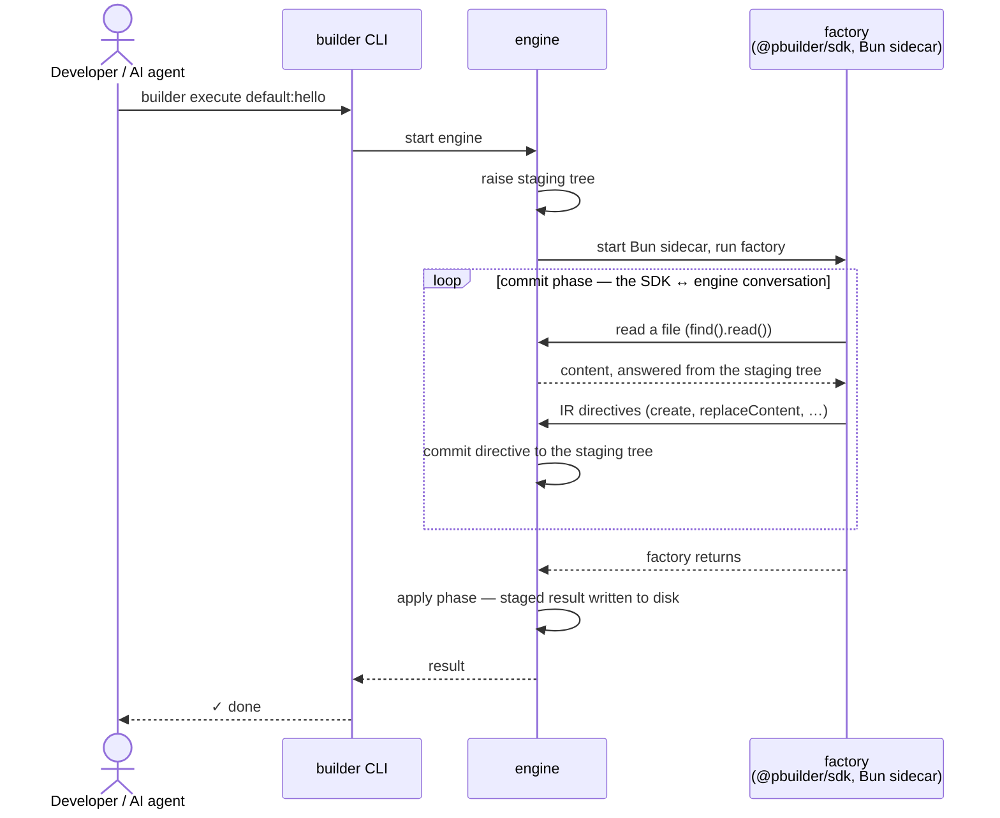

# @pbuilder/sdk

> The TypeScript/Bun authoring layer for [Project Builder](https://github.com/Project-Builder-Schematics) schematics.

Project Builder exists to give developers — **and the AI agents working alongside them** —
deterministic code generation. A prompt produces something different every run; a
**schematic** — a typed, testable file-mutation program — produces the same files, byte for
byte, every time. You (or your agent) encode the change once, and from then on generation
is a program you run, not an output you review.

Three pieces cooperate, each with a sharply drawn responsibility:



- The **`builder` CLI** owns every user- and agent-facing interaction: initialising a
  workspace, scaffolding schematics, executing them (`init` / `new` / `execute`), and the
  AI skill it drops into your repo so agents can drive it too. It ships the engine and
  starts it on every run.
- **This SDK** owns the developer experience — typed verbs, templates, dialects, the
  testing harness — and lowers everything you author into a small, stable **IR**
  (instruction records). It holds a conversation with the engine over framed stdio: reads
  come back from the staging tree, directives go out as IR. It never writes to disk.
- The **engine** owns execution, in two phases. During the run — the **commit phase** —
  it raises the staging tree, starts the Bun sidecar that runs your factory, answers its
  read-backs, and commits every incoming IR directive to the staging tree. Only after the
  factory returns does the **apply phase** begin: the staged result is written to disk.
  The engine is the only component that ever writes — and a failed run writes nothing.

That staging tree is what makes a schematic a conversation rather than a one-shot: while
the factory runs, the SDK reads file contents back from it and emits mutations in
response — idempotent, content-aware edits instead of blind overwrites.

## Installation

### macOS / Linux

With [Homebrew](https://brew.sh) installed, grab the CLI (the `builder` binary) from the
tap:

```sh
brew install project-builder-schematics/tap/pbuilder
```

On Linux/WSL2 this needs a recent Homebrew — the cask install is verified on Homebrew 6.x;
older versions refuse casks on Linux. No Homebrew at all? Download the per-platform
tarball from the
[tap's releases](https://github.com/Project-Builder-Schematics/homebrew-tap/releases)
(`pbuilder_<version>_linux_amd64.tar.gz` and friends) and put `builder` on your `PATH` —
no brew required.

Schematics execute through a [Bun](https://bun.sh) sidecar, so Bun must be installed too:

```sh
brew install oven-sh/bun/bun   # or: curl -fsSL https://bun.sh/install | bash
```

Bun is only the schematics' runtime — your project itself keeps whatever package manager
and tooling it already uses (npm, pnpm, yarn, …).

This guide was verified against CLI **0.6.0** and SDK **0.2.x**.

### Windows

> **Not yet supported.** Windows builds of the CLI are on the roadmap; in the meantime the
> supported path on Windows is WSL2 (Ubuntu), using the Linux instructions above.

### The SDK itself

You normally don't install it by hand — `builder init` (below) adds `@pbuilder/sdk` to your
project's `devDependencies` automatically. To add it manually, use whichever package
manager your project already uses:

```sh
npm install -D @pbuilder/sdk    # or: pnpm add -D / yarn add -D / bun add -d
```

## Your first schematic in five minutes

Every step below is runnable exactly as written.

**1. Initialise a workspace** (inside any project — new or existing):

```sh
builder init
```

This creates `project-builder.json` (the workspace config), a `schematics/` folder, and an
AI skill under `.claude/skills/pbuilder/` — a command reference your coding agent picks up
automatically, no wiring needed. It also installs `@pbuilder/sdk` as a dev dependency,
creating a `package.json` first if the folder doesn't have one.

**2. Scaffold a schematic:**

```sh
builder new schematic hello
```

You get a registered, ready-to-edit package:

```
schematics/hello/
├── schema.json           # typed inputs — the contract with the user
├── schema.generated.ts   # generated from schema.json — never edit
└── factory.ts            # your authoring logic
```

`project-builder.json` now lists it under `collections.default.hello`.

**3. Declare the inputs** — replace the generated `schema.json`'s contents with the
following; every property needs a `label` (codegen fails without it):

```json
{
  "properties": {
    "name": { "type": "string", "label": "Service name", "required": true }
  }
}
```

Property types are `string`, `number`, `boolean`, and `enum` (which requires a non-empty
`choices` array); `default` and `description` are optional.

**4. Regenerate the input types:**

```sh
bunx pbuilder-codegen schematics/hello
```

This rewrites `schema.generated.ts` with an `Input` type derived from your schema — your
factory is typed against the schema, never against a hand-written shape.

**5. Write the factory** (`schematics/hello/factory.ts`):

```ts
import { create, find, replaceContent } from "@pbuilder/sdk/commons";
import type { Input } from "./schema.generated.ts";

export default async (input: Input) => {
  // create a new file
  create(`src/services/${input.name}.ts`, {
    template: `export const serviceName = "${input.name}";`,
    options: {},
  });

  // content-aware edit: read the tree, then create or update
  const existing = await find("services.txt").read();
  if (existing === undefined) {
    create("services.txt", { template: input.name, options: {} });
  } else {
    replaceContent("services.txt", `${existing}\n${input.name}`);
  }
};
```

The engine invokes the module's **default export** — that's the factory. (This one builds
its output strings in TypeScript; the template language below is the declarative
alternative. And if your editor flags the `.ts`-extension import or `bun:test`, that's
just missing tsconfig settings — the [quickstart](./docs/quickstart.md) ships one; Bun
itself runs fine without it.)

**6. Execute it** — `default:hello` is `<collection>:<schematic>` as registered in
`project-builder.json`; inputs are passed as CLI flags:

```sh
builder execute default:hello --name=payments
```

```
~ services.txt
~ src/services/payments.ts
✓ done — 2 modified
```

(`~` marks a path the run wrote.) Now run it again **with a different input**:

```sh
builder execute default:hello --name=orders
```

`services.txt` grows by one line instead of being clobbered — that's the read-back loop
from step 5 doing its job. Re-running with the **same** name, on the other hand, rejects
with `path-collision`: `create` is fail-closed on an existing path (pass `force: true` to
overwrite deliberately), and since a failed run writes nothing, your tree is left exactly
as it was.

**7. Test it** without the CLI or a running engine — see
[Testing your factory](#testing-your-factory) below.

From here: [Authoring verbs](./docs/authoring-verbs.md) is the full reference for
everything you can do inside a factory, and the
[quickstart](./docs/quickstart.md) covers the standalone-package setup (tsconfig
included) in more depth.

## The seven mutations

Everything a factory can do to the tree is one of seven mutation verbs, all imported from
`@pbuilder/sdk/commons`:

| Verb | What it schedules |
|---|---|
| [`create(path, opts)`](./docs/authoring-verbs.md#create) | A new file. `path` and `template` are template strings rendered against one `options` object; the `templateFile` overload renders a package-local file instead. |
| [`replaceContent(path, content)`](./docs/authoring-verbs.md#replacecontent) | Wholesale replacement of an existing file's content. |
| [`remove(path)`](./docs/authoring-verbs.md#remove) | A deletion. Idempotent on an absent path. |
| [`rename(path, newName)`](./docs/authoring-verbs.md#rename) | A basename-only rename in place. |
| [`move(path, toDir)`](./docs/authoring-verbs.md#move) | A move to a different directory. |
| [`copy(from, to)`](./docs/authoring-verbs.md#copy) | A tree-to-tree copy, chainable via the returned handle. |
| [`copyIn(from, to)`](./docs/authoring-verbs.md#copyin) | A package-local file copied into the tree **verbatim** — the never-render escape hatch. |

The verbs that write to a new path — `create`, `rename`, `move`, `copy`, `copyIn`, and
`scaffold` — are fail-closed on collision and accept `{ force: true }` for a deliberate
overwrite: `create` and `scaffold` inside their options/args object, the rest as a
trailing argument.

Three companions round out the surface:

- [`find(path).read()`](./docs/authoring-verbs.md#the-read-trichotomy-findpathread) — read
  a file back from the staging tree.
- [`scaffold({ from, to, options })`](./docs/authoring-verbs.md#scaffold) — mirror an
  entire package-local folder into the tree, with dynamic file names. The workhorse for
  multi-file generators — see [Scaffolding a folder of templates](#scaffolding-a-folder-of-templates).
- [`dryRun()`](./docs/dry-run.md) — inspect the directives still **pending**. A `read()`
  drains the buffer, so call it before reading if you want the full picture.

### What to keep in mind

Rules that save you real debugging time — each one is a mistake we've watched happen:

- **Always pass `options: {}` to `create`**, even when the template has no tokens. The
  type requires it — and in untyped call sites (plain JS, `any`) omitting it puts
  `undefined` in the directive batch, rejecting the write as unrepresentable.
- **`find().read()` is a trichotomy**: `undefined` means the file is absent, `""` means it
  exists and is empty. Branch on `=== undefined` — never `if (!content)`, which conflates
  the two. (`classifyContent()`, from the same module, turns the result into a value you
  can `switch` over exhaustively.)
- **Make mutations idempotent.** Factories re-run against already-generated projects; check
  whether your marker/import/entry is already present before inserting it. The step-5
  example shows the read-back mechanics — a production factory would also skip the append
  when the name is already listed.
- **Nothing touches disk while your factory runs.** Verbs *schedule* directives; during the
  run the engine commits them to the staging tree only (that's why reading a path you
  created earlier in the same run sees the staged content). Disk writes happen in the apply
  phase, after the factory returns — a thrown error before return means nothing is written
  at all.
- **Errors are structured.** A rejected run surfaces an `AuthoringError` with
  `verb`/`path`/`reason` fields telling you which directive failed and why (one label
  quirk: content replacement reports `verb: "modify"` — including plain
  `replaceContent()`) — see the [error contract](./docs/authoring-errors.md).

## How templates work

`create`'s `path` and `template` are both **template strings**, rendered against the same
single `options` object — that's the core idea:

```ts
create("src/{= .name | dasherize =}/{= .name | dasherize =}.component.ts", {
  template:
    "export class {= .name | classify =}Component {\n" +
    "{= range .methods =}  {= .name =}() {}\n{= end =}}\n",
  options: {
    name: "userProfile",
    methods: [{ name: "load" }, { name: "save" }],
  },
});
```

renders the path `src/user-profile/user-profile.component.ts` with content:

```ts
export class UserProfileComponent {
  load() {}
  save() {}
}
```

The essentials:

- **Delimiters are `{= =}`, not `{{ }}`.** Inside them you reference options with a leading
  dot: `{= .name =}`, nested walks like `{= .user.address.city =}`, and `{= . =}` for the
  current context inside a loop.
- **Rendering happens in the engine at `builder execute` time, never in the SDK.** Your
  factory ships the template and options verbatim — so template errors (a typo'd option
  name, a type mismatch) surface at run time, and the test harness stores the raw
  `{= .name =}` text, not rendered output.
- **7 pipes transform string values**, chained left to right with `|`. From `"userProfile"`:
  `upper` → `USERPROFILE`, `lower` → `userprofile`, `capitalize` → `UserProfile`,
  `dasherize` → `user-profile`, `underscore` → `user_profile`, `camelize` → `userProfile`,
  `classify` → `UserProfile`. There is **no pluralize**, and `classify` does **not**
  singularize (`users` → `Users`, not `User`) — if you need the singular, pass it in your
  options.

The syntax comes from Go's `text/template`, **not** JavaScript — two rules prevent most of
the surprises:

- **Blocks open with a keyword and close with `{= end =}`** — no braces. Loops are `range`
  (the dot becomes the current element), conditionals are `if`/`else if`/`else`:

  ```
  {= range .methods =}  {= .name =}() {}
  {= end =}
  {= if eq .kind "primary" =}main{= else =}other{= end =}
  ```

- **Comparisons and logic are operator-first function calls**, never infix: `eq a b`,
  `ne`, `lt`, `gt`, `and`, `or`, `not` — `a === b && c` does not exist; you write
  `and (eq .a .b) .c`.

Two traps worth knowing before they bite: **empty arrays and objects are falsy** (so
`{= if .items =}` is the "has items" check — no `.length`), and **number literals must match
the numeric type** they're compared against (option numbers are decimals: `eq .count 2.0`,
never `eq .count 2`).

If templating gets in your way, the escape hatch is always available: build the final
strings in TypeScript and pass a token-free template — it renders verbatim. For the full
language — `with`, variables, whitespace rules, output-path templating, sandbox limits, and
the error taxonomy — see [Authoring `create` templates](./docs/create-templates.md).

## Scaffolding a folder of templates

For anything bigger than a couple of files, don't write one `create()` per file — keep a
folder of template files inside your schematic package and mirror it with **`scaffold`**:

```
schematics/service/
├── schema.json
├── schema.generated.ts
├── factory.ts
└── files/                                       # your template folder
    ├── __name@dasherize__.service.ts.template
    ├── __name@dasherize__.spec.ts.template
    └── config/
        └── settings.json
```

```ts
import { scaffold } from "@pbuilder/sdk/commons";
import type { Input } from "./schema.generated.ts";

export default (input: Input) => {
  scaffold({
    from: "files",
    to: "src/services/__name@dasherize__",
    options: { name: input.name },
  });
};
```

With `name: "userProfile"` this emits `src/services/user-profile/user-profile.service.ts`,
`…/user-profile.spec.ts`, and `…/config/settings.json` — contents rendered against the same
`options`, using the template language above.

### Dynamic file names

File and folder names carry dynamic values through **filename tokens**:

- `__name__` becomes `{= .name =}` — the `name` option, rendered into the path.
- `__name@pipe__` becomes `{= .name | pipe =}` — same 7 pipes as templates, so
  `__name@dasherize__.service.ts` with `name: "userProfile"` lands as
  `user-profile.service.ts`.
- The `to` destination is translated the same way — that's how one `scaffold` call fans out
  into a per-option directory (`to: "src/services/__name@dasherize__"` above).

`scaffold` only rewrites the marker syntax; the rendering itself happens in the engine,
exactly as for `create` templates.

Three more per-entry controls, applied in a pinned order (`rename` first, token translation
second, `.template` strip last):

- **`.template` suffix** — stripped from the destination name. Use it to keep template
  files from looking like real source to your editor/tooling
  (`user.service.ts.template` → `user.service.ts`).
- **`rename`** — a static remap table matched against the *original* source-relative path,
  for the odd file whose destination doesn't follow the pattern.
- **`include` / `exclude`** — glob filters over the original paths (`*` within a segment,
  `**` across segments; `exclude` wins).

Each surviving file is classified automatically: valid, in-budget text renders as a
template; binary or over-budget files travel verbatim (`copyIn`). Caveats: an empty `from`
folder is a silent no-op (and npm packaging commonly drops empty directories — ship a
placeholder if the folder's presence matters) while `include`/`exclude` filters that
eliminate every entry reject loudly, nested symlinked directories are skipped
silently while a symlinked `from` root rejects outright, and a single call caps at 10,000
entries. Full edge-and-error semantics:
[`scaffold` in Authoring verbs](./docs/authoring-verbs.md#scaffold).

`scaffold`, `copyIn`, and `create({ templateFile })` resolve **package-local** files
(relative to your schematic's folder), so the run must know where that package is — the CLI
passes this automatically; in tests you pass `packageDir` yourself (below).

## Testing your factory

`@pbuilder/sdk/testing` runs a factory in-memory — no CLI, no engine, no disk. Create
`schematics/hello/factory.test.ts` next to the factory:

```ts
import { test, expect } from "bun:test";
import { runFactoryForTest } from "@pbuilder/sdk/testing";
import { create } from "@pbuilder/sdk/commons";

// in your schematic this is `import run from "./factory.ts";`
const run = (input: { name: string }) => {
  create(`src/services/${input.name}.ts`, {
    template: `export const serviceName = "${input.name}";`,
    options: {},
  });
};

test("factory creates the service file", async () => {
  const result = await runFactoryForTest(run, { name: "payments" });

  expect(result.error).toBeUndefined();
  expect(result.tree.get("src/services/payments.ts"))
    .toEqual(`export const serviceName = "payments";`);
});
```

```sh
bun test schematics
```

This runs only your schematic tests under Bun — your app's own test runner (Jest, Vitest,
whatever you use) stays untouched and the two coexist in one repo.

Two things to know:

- `result.tree` contains **committed writes only**. Files you pre-populate via the `seed`
  option are readable by the factory but never appear in the tree — which is exactly how
  you assert idempotence (an untouched seed is absent from the tree):

  ```ts
  import { test, expect } from "bun:test";
  import { runFactoryForTest } from "@pbuilder/sdk/testing";
  import { find, replaceContent } from "@pbuilder/sdk/commons";

  test("a seeded file is readable; only the write is committed", async () => {
    const run = async (input: { name: string }) => {
      const existing = await find("services.txt").read();
      replaceContent("services.txt", `${existing}\n${input.name}`);
    };

    const seed = { "services.txt": "payments" };
    const result = await runFactoryForTest(run, { name: "orders" }, { seed });

    expect(result.error).toBeUndefined();
    expect(result.tree.get("services.txt")).toEqual("payments\norders");
  });
  ```

- The options bag's other field, `packageDir` (pass `import.meta.dir`), anchors the
  package-local verbs (`scaffold`, `copyIn`, `create({ templateFile })`) and opts the run
  into schema-derived input validation against the adjacent `schema.json`. Without it those
  verbs have nothing to resolve against.

Templates are stored **verbatim** in the test tree — rendering is the engine's job, and the
harness doesn't fake it. `./testing` ships `0.x`, semver-exempt, until real use validates
the result shape. (It tests *your factory*; the separate `./conformance` surface
conformance-tests a *dialect or op-pack* implementation — not the same audience.)

## Beyond the verbs: dialects

When string-level mutation isn't enough — "add an import to this module", "set a prop on
this JSX element" — **dialects** provide structured, AST-aware operations for one file
type: see [authoring a dialect](./docs/authoring-a-dialect.md) for the full story. Two
ship today: `@pbuilder/sdk/typescript` and `@pbuilder/sdk/react`.

A dialect's entry point is its own `find(path)`: it opens a **coalescing, awaitable
handle**. Every op you chain mutates the same live AST, and the handle serializes to
exactly **one** `replaceContent`-style directive when it flushes — chaining three ops does
not produce three writes.

### `@pbuilder/sdk/typescript`

```ts
import * as ts from "@pbuilder/sdk/typescript";

await ts.find("src/index.ts")
  .addImport("readFileSync", "node:fs")
  .addFunction("hi", "(): void {}", { export: true });
```

| Op | What it does |
|---|---|
| `addImport(name, from)` | Adds `import { name } from "from"`, merging into an existing clause from the same module. Idempotent — calling it twice never duplicates the import. |
| `removeImport(name, from)` | Removes the named binding; deletes the whole statement when it was the last one. Idempotent on an absent binding. |
| `addFunction(name, source, opts?)` | Appends a top-level function. `source` **includes** the braces (`"(): void {}"`). |
| `addVariable(name, initializer, opts?)` | Appends a top-level variable (`kind` defaults to `const`). |
| `addClass(name, source, opts?)` | Appends a top-level class. `source` **excludes** the braces — the op adds them. |
| `.modify(fn)` | The universal escape hatch: direct [ts-morph](https://ts-morph.com) access to the file's AST for anything the named ops don't cover. |

The `add*` ops fail loud on a name collision with an existing value declaration or import
binding (two value declarations sharing a name is invalid TypeScript); a `type`/`interface`
sharing the name does not collide. `source`/`initializer` strings are inserted **verbatim**
— never validated or sanitized — so the author owns their syntax, and anything derived from
untrusted input is the author's responsibility to sanitize.

### `@pbuilder/sdk/react`

Mutates `.tsx` files — `find()` requires the explicit `.tsx` extension (extensionless and
`.jsx` paths are rejected, never normalized). The v1 op-pack — a dialect's bundle of named
ops — is deliberately minimal: two structured ops, with `.modify(fn)` as the escape hatch
for everything else:

```ts
import * as react from "@pbuilder/sdk/react";

// src/Button.tsx before: const el = <Button />;
await react
  .find("src/Button.tsx")
  .addImport("handleClick", "./handlers")
  .setJsxProp("Button", "onClick", "{handleClick}");
// -> import { handleClick } from "./handlers";
// -> const el = <Button onClick={handleClick} />;
```

| Op | What it does |
|---|---|
| `addImport(name, from)` | Same contract as the TypeScript dialect's — idempotent, named-binding-only (no default/namespace imports in v1). |
| `setJsxProp(element, prop, value?)` | Sets a prop on **the one** element with that tag name — zero or multiple matches reject loudly. `value` takes three forms: `'"hi"'` (string), `'{count}'` (expression), or omitted (boolean shorthand). |

`setJsxProp`'s `value` is emitted verbatim into executable code — same trust boundary as
the TypeScript `source` strings. One React-specific subtlety: an inserted prop lands after
a trailing `{...spread}`, so it **wins** at runtime under React's later-position precedence.

### `.modify()` — the universal escape hatch

Every dialect handle carries one universal op alongside its named ops: `.modify(ast => …)`.
Your callback receives the **same live AST instance the named ops mutate** — a ts-morph
`SourceFile` — so anything a named op could do, `.modify()` can do too, without waiting for
a structured op to exist:

```ts
import * as ts from "@pbuilder/sdk/typescript";

await ts.find("src/app.module.ts")
  .addImport("BooksModule", "./books/books.module")
  .modify((ast) => {
    // full ts-morph surface available here — decorators, call args, anything
    const imports = ast
      .getClassOrThrow("AppModule")
      .getDecoratorOrThrow("Module")
      .getArguments()[0];
    // …structured edits the named ops don't cover yet
  });
```

Because it joins the same coalescing chain, mixing named ops and `.modify()` on one handle
still flushes as a **single** write. Two things to respect:

- **Operate only on the `ast` the callback hands you.** If your schematic depends on
  ts-morph directly, that is a *separate realm* from the SDK's internal ts-morph — a
  `Node` or `SourceFile` from your own import is not interchangeable with the callback's
  AST, even at the identical ts-morph version. Never pass ts-morph objects across that
  boundary.
- **`.modify()` runs with full process privilege — it is not a sandbox.** Your own
  callbacks are your own trust; before importing a *third-party* dialect or op-pack built
  on it, read [SECURITY.md](./SECURITY.md).

### Going deeper

Everything dialect-related lives in one reference page —
[Authoring a dialect](./docs/authoring-a-dialect.md): the complete method-by-method
contracts of both shipped dialects (collision rules, idempotency, rejection semantics),
how coalescing turns chained edits into one directive, async usage, and building a dialect
of your own with `defineDialect`/`defineOpPack`, validated by the conformance kit (the
`./conformance` suite that proves a dialect parses and prints files with full fidelity).
If a named op behaves in a way that surprises you, that page is where the exact contract
is written down.

## Documentation

The full reading path lives in [`docs/`](./docs/README.md):

1. [Quickstart](./docs/quickstart.md) — standalone factory package, tsconfig, codegen, test.
2. [Authoring verbs](./docs/authoring-verbs.md) — the seven verbs + `find().read()` in full.
3. [Authoring `create` templates](./docs/create-templates.md) — the template language.
4. [Error contract](./docs/authoring-errors.md) — `AuthoringError` and recovery.
5. [Dry-run](./docs/dry-run.md) — previewing planned changes.
6. [Authoring a dialect](./docs/authoring-a-dialect.md) — AST-aware mutation per file type.

## Design at a glance

- **Surface ≠ contract** — rich authoring verbs lower to a small, stable IR.
- **AST-agnostic engine** — AST tooling (ts-morph, …) lives in SDK dialect modules, never in
  the engine. New file types are new packages, not engine releases.
- **Bun-native** — factories run as TypeScript directly, no transpile step.

## Development

Contributing to the SDK itself:

```sh
bun install
bun test
bun run typecheck
```

Packaging note: `dist/core/**` ships in the tarball, documented, not stripped —
`./testing`'s runtime imports it, so it must be physically present; `@pbuilder/sdk/core`
stays unreachable via `package.json#exports` regardless (the boundary is
advisory-by-convention, not enforced by tarball exclusion).

`conformance/` — SDK↔engine live conformance corpus, consumed by `project-builder-engine` as a
pinned git submodule; see `conformance/README.md` and `CONFORMANCE-CORPUS-HANDOFF.md`.

### Local registry (Verdaccio)

Test real publishes — tarball, `files`, `exports`, `bin` — before anything reaches npmjs.
Unlike `bun link`, this exercises the actual packaging step, so dist/packaging bugs surface
locally instead of on first contact with a consumer.

```sh
# terminal 1 — start the registry (runs in foreground)
bun run registry:up

# terminal 2 — build + publish the version in package.json under dist-tag `local`
bun run publish:local
```

Consume from another repo (e.g. `project-builder-engine`) by pointing only the `@pbuilder`
scope at the local registry:

```toml
# bunfig.toml
[install.scopes]
"@pbuilder" = "http://localhost:4873"
```

```sh
bun add @pbuilder/sdk@local   # always resolves the latest local publish
```

With npm, use `@pbuilder:registry=http://localhost:4873` in the consumer's `.npmrc` instead.

Notes:

- The `@pbuilder/*` scope is local-authoritative (no npmjs proxy) — a local publish can never
  be shadowed by the public package. Everything else proxies through to npmjs with caching.
- `publish:local` publishes the version currently in `package.json` — publishing the same
  version twice fails, so bump the version or reset the registry storage between publishes.
- To reset the registry, stop it and delete `tools/verdaccio/storage/` (git-ignored).
- Registry config lives in `tools/verdaccio/config.yaml`.

## License

[MIT](./LICENSE)
